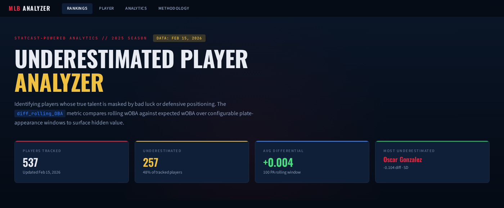
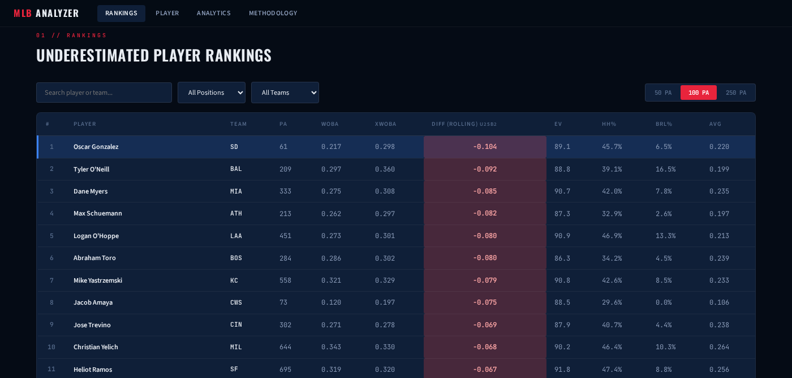
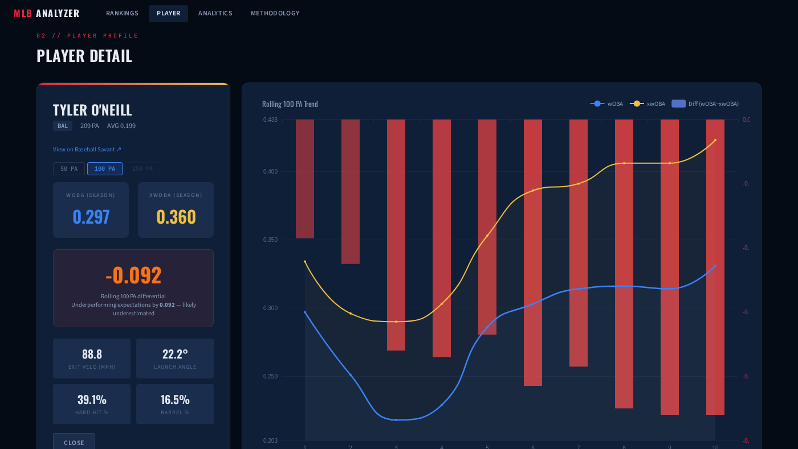
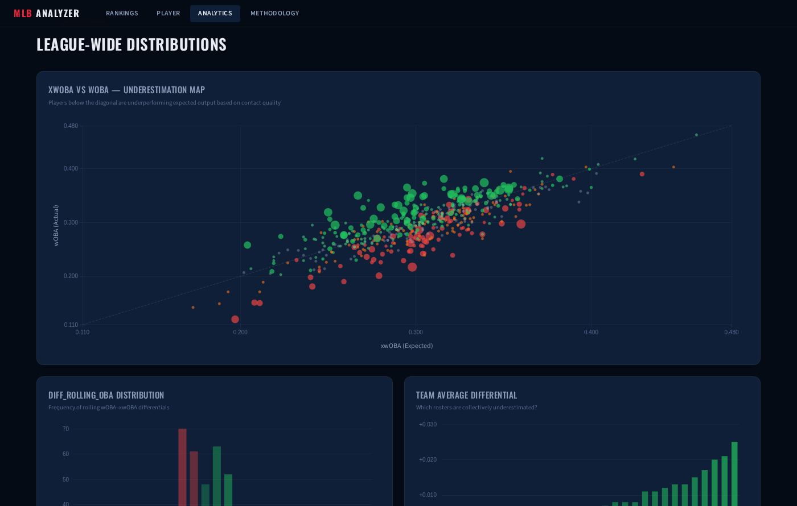

# MLB Underestimated Player Analyzer

A dashboard that surfaces MLB hitters whose results lag behind their underlying quality of contact. Updated daily during the season.

[Daily Underestimated MLB Player Dashboard](https://lch99310.github.io/Daily_underestimated_MLBplayer_ranking/)

## What This Does

Every hitter in baseball has two versions of their offensive output:

- **wOBA** (weighted on-base average) — what actually happened on the field
- **xwOBA** (expected wOBA) — what *should* have happened based on how hard and at what angle they hit the ball

The gap between these two numbers reveals luck, defensive positioning, and park effects. A hitter with a much lower wOBA than xwOBA is producing weaker results than the quality of his contact deserves. These players are **underestimated** — their stat line looks worse than they actually are, and they are strong candidates to rebound.

This tool tracks 537 qualified batters, computes rolling differentials over configurable plate-appearance windows (50 / 100 / 250 PA), and ranks every hitter by how underestimated they are.

## What You Can Do With This Data

- **Fantasy baseball**: Target underperformers for buy-low trades — their surface stats look bad, but their contact quality says a rebound is coming
- **Betting**: Identify hitters likely to heat up when the market still prices them at their depressed stat line
- **Front office / scouting**: Separate genuine decline from bad luck when evaluating trade targets or free agents
- **Fan analysis**: Understand why a favorite player's batting average doesn't match the eye test

## Rankings

The main table ranks every qualified hitter by `diff_rolling_OBA` — the rolling difference between wOBA and xwOBA. Negative values (red) mean the player is underestimated. You can sort by any column, filter by team or position, and toggle between 50 / 100 / 250 PA rolling windows.

## Player Detail

Click any player to see their full profile: season wOBA vs xwOBA, Statcast metrics (exit velocity, launch angle, hard hit %, barrel %), and a trend chart showing how their rolling wOBA and xwOBA have moved over time. The red bars show the differential at each point — persistent red bars mean the underperformance is ongoing, not a one-time blip.

## League-Wide Analytics

The scatter plot maps every hitter's xwOBA (x-axis) against their actual wOBA (y-axis). Players below the diagonal line are underperforming expectations. The histogram shows the distribution of differentials across the league, and the team chart reveals which rosters are collectively underestimated.

---

## Case Study: Tyler O'Neill (BAL)

Tyler O'Neill entered 2025 with 209 plate appearances, a .199 batting average, and a .297 wOBA — numbers that suggest a below-average hitter struggling at the plate. But his contact quality tells a different story:

| Metric | Value | Context |
|--------|-------|---------|
| xwOBA | .360 | Well above league average |
| Barrel % | 16.5% | Elite — top tier in baseball |
| Max exit velocity | 113.6 mph | Premium raw power |
| Launch angle | 22.2 deg | Optimal range for power production |
| diff_rolling_OBA (100 PA) | **-0.092** | Among the most underestimated hitters in MLB |

O'Neill's xwOBA of .360 places him among the league's better hitters based purely on the quality of his batted balls. His 16.5% barrel rate is elite. Yet his actual wOBA sits 63 points lower than expected at .297.

What's happening? His trend chart shows the gap between xwOBA (gold line) and wOBA (blue line) widening consistently across his rolling 100 PA windows. The red differential bars persist throughout — this is sustained bad luck or adverse defensive shifting, not a brief cold streak.

Statistically, hitters with this profile tend to regress toward their expected output. O'Neill's contact quality is too good for his results to stay this depressed. He is a textbook underestimated player — his batting average says one thing, his Statcast metrics say another.

---

## How the Data Updates

The dashboard refreshes automatically every day during the MLB season. Outside the season, the data stays frozen at the last available date. The data timestamp is shown in the header of the dashboard.

---

